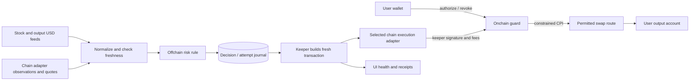

# Stack and telescopic architecture

## Stack decisions

| Area | Planned choice | Reason / boundary |
|---|---|---|
| Service | TypeScript, Bun, native HTTP and WebSocket clients | One service and one worker loop; no queue platform or microservices |
| UI | React + Vite, Wallet Standard behind the Solana browser adapter | Wallet discovery, message signing and wallet-native transaction submission; server serves built assets |
| Program | Rust + Anchor | Typed authorization accounts and CPI constraints |
| Solana adapter | Anchor-compatible web3.js v1 + SPL Token clients | Confined to the adapter; pin mutually compatible versions in M01 |
| Adapter boundary | Small typed reader, authorization, execution and wallet ports | Shared workflow has no chain SDK dependency; only Solana is implemented initially |
| Kernel / coverage | Pure TypeScript contracts, exact units and validated versioned manifests | Separate asset configuration from executable chain, DEX and aggregator integrations |
| Future EVM adapter | TypeScript/viem, Solidity/Foundry | Separate permission-enforcing contract and native receipt/nonce handling; later phase |
| Persistence | PostgreSQL + Bun SQL, isolated app schema | Durable policies, decisions and attempts; matches parent workspace conventions |
| Stock reference | Alpaca SIP quotes, selected ticker | Consolidated live coverage; existing entitlement must be verified; free IEX is not equivalent |
| Chain | Helius WebSockets; independent secondary RPC | Wallet/mint/pool updates, confirmed reconciliation and slot-lag checks |
| Quotes | Direct Raydium CLMM account-state quote | M01 proved the AAPLx/USDC PDA staging path; no aggregator account required initially |
| Execution | One pinned route implemented by a constrained CPI adapter | Never forward arbitrary keeper-selected program calls |
| Output valuation | Kraken public USDC/USD ticker stream | Timestamped exchange bid/ask verified in M01; freshness/spread/size gates, no assumed peg |
| Tests | bun test, cargo test, real SVM integration, Playwright | Pure logic, permissions, actual swaps, browser journey |
| Hosting | One app/keeper process under systemd, HTTPS proxy, PostgreSQL | Restart recovery and wallet HTTPS; no Kubernetes/Redis |

Mainnet is the sole deployed target for program, wallet, feeds and swaps. Reject
an RPC connected to the wrong network. Local unit/SVM harnesses exercise the
same account formats, program logic and route adapter using isolated snapshots;
they introduce no Devnet/Testnet product branches or separate liquidity market.
The first live demonstration uses a dedicated team wallet with explicit capital,
fee and deployment-allocation budgets. Calculate program deployment allocation
from the compiled binary instead of equating it with swap transaction fees.

Anchor and Solana CLI were not found on PATH during planning. Bun and Cargo were
present. This is a toolchain prerequisite to verify, not proof of incompatibility.
M01 installed and checksum-verified project-local Agave 4.3.0 and built the
local-only SBF feasibility probe. Anchor CLI is still uninstalled. Dependency
setup is now authorized for implementation; paid subscriptions remain unpurchased.

## Proposed tree (source is not yet created)

Directory coordinators target <=50 physical lines; leaves <=200. Root and all
stage coordinators primarily call substeps. Use one implementation concern per
leaf; retain readable names rather than padding or minifying to satisfy counts.
`mod.ts` follows the user's crypto-model-clean `mod.rs` pattern.
There is one project root, `root.ts`. The app is step `_5_app`, with `mod.tsx`
as its browser entry and coordinator, not another root.

```text
solstock-guard/
├── README.md                         # purpose, status, documentation index
├── AGENTS.md                         # architecture and implementation invariants
├── root.ts                           # wire adapters, stages and app; one project root
├── _kernel/
│   ├── mod.ts                        # public pure domain/contract entry
│   ├── _0_types/mod.ts              # asset, holding, observation, policy, attempt
│   ├── _1_ports/mod.ts              # chain, venue, aggregator, feed and rule ports
│   ├── _2_catalog/mod.ts            # validate coverage and match capabilities
│   ├── _3_policy/mod.ts             # canonical policy identity and versioned bounds
│   └── _4_units/mod.ts              # exact amounts, conversions and rounding
├── _0_setup/
│   ├── mod.ts                        # validate configuration and start resources
│   ├── _0_config/mod.ts              # mode, asset manifest, provider credentials
│   ├── _1_storage/mod.ts             # schema version and database connections
│   ├── _2_lifecycle/mod.ts           # reverse-order awaited resource cleanup
│   └── _3_process/mod.ts             # foreground signal handling and exit status
├── _1_feeds/
│   ├── mod.ts                        # construct the port-only policy monitor
│   └── _0_cache/mod.ts              # shared watchers, gap epochs, isolated snapshots
├── _2_risk/
│   ├── mod.ts                        # construct a policy-bound pure risk rule
│   ├── _0_evidence/mod.ts           # eligibility, units, freshness and exact valuation
│   └── _1_rules/mod.ts              # persistence, gap resets and versioned decisions
├── _3_execution/
│   ├── mod.ts                        # construct the shared foreground worker
│   ├── _0_prepare/mod.ts             # refresh risk, simulate/sign, journal before send
│   ├── _1_recover/mod.ts             # reconcile saved bytes before new execution
│   ├── _2_evaluate/mod.ts            # native authority -> current rule -> bounded intent
│   └── _3_worker/mod.ts              # paged discovery, fenced claims, scheduling/shutdown
├── _4_authorization/
│   ├── mod.ts                        # common create/revoke/read policy workflow
│   ├── _0_preview/mod.ts            # show actual adapter capabilities and limits
│   ├── _1_arm/mod.ts                # prepare owner authorization; verify completion
│   └── _2_revoke/mod.ts             # prepare cancellation; verify chain state
├── _5_app/
│   ├── mod.tsx                      # app step: browser entry, wallet and composition
│   ├── _0_overview/mod.tsx           # balances, prices, coverage and health
│   ├── _1_arm/mod.tsx                # preview policy and request wallet signature
│   ├── _2_activity/mod.tsx           # evidence, attempt status and receipt links
│   ├── _3_revoke/mod.tsx             # wallet-signed cancellation and verification
│   └── _4_api/
│       ├── mod.ts                   # HTTP routing and status stream
│       ├── _0_auth/mod.ts           # wallet challenge, origin/domain, expiry/replay
│       ├── _1_policies/mod.ts       # policy drafts and confirmed state queries
│       └── _2_events/mod.ts         # health/activity SSE and access controls
├── _adapters/
│   ├── mod.ts                       # explicit registry; root imports this factory
│   ├── _0_solana/
│   │   ├── mod.ts                   # construct Solana server ports
│   │   ├── _0_watch/mod.ts          # RPC/WSS, account decoding, slot/gap recovery
│   │   ├── _1_authorize/mod.ts      # PDA, approval/revoke encoding and state reads
│   │   ├── _2_swap/mod.ts           # compose permitted venue/router; build/send
│   │   ├── _3_receipts/mod.ts       # blockhash validity and confirmation semantics
│   │   ├── _4_wallet/mod.tsx        # separate browser-safe wallet adapter entry
│   │   ├── _venues/
│   │   │   ├── mod.ts              # compose validated venue capabilities
│   │   │   └── _0_selected_dex/mod.ts # M01-selected program/accounts/route checks
│   │   ├── _aggregators/           # only if M01 chooses an aggregator route
│   │   │   ├── mod.ts              # compose supported aggregator clients
│   │   │   └── _0_jupiter/mod.ts   # candidate quote/build API; validate each leg
│   │   ├── _shared/                 # Solana-only codecs and RPC helpers
│   │   └── program/
│   │       ├── Cargo.toml           # Anchor/SPL versions
│   │       └── src/
│   │           ├── lib.rs          # instruction dispatch only
│   │           ├── _0_authorize/mod.rs  # owner constraints and policy creation
│   │           ├── _1_execute/mod.rs    # validate -> allowed CPI -> settle/consume
│   │           ├── _2_revoke/mod.rs     # owner cancellation
│   │           └── _shared/        # Rust account types and errors
│   ├── _1_evm/                     # future only; no empty implementation today
│   │   ├── mod.ts                  # future EVM server ports
│   │   ├── _0_watch/mod.ts         # logs, balances and reorg reconciliation
│   │   ├── _1_authorize/mod.ts     # bounded contract authorization/revocation
│   │   ├── _2_swap/mod.ts          # permitted router and native fee/nonce handling
│   │   ├── _3_receipts/mod.ts      # replacement, reorg and finality handling
│   │   ├── _4_wallet/mod.tsx       # browser-safe EVM wallet entry
│   │   └── contracts/              # Solidity guard and Foundry tests
│   └── _2_alpaca/
│       ├── mod.ts                  # stock reference provider port
│       ├── _0_stream/mod.ts        # subscriptions, decoding and reconnect
│       └── _1_sessions/mod.ts      # market calendar and quote status
├── _shared/
│   ├── mod.ts                       # common infrastructure entry
│   ├── _0_store/mod.ts              # durable repositories and lock primitives
│   └── _1_health/mod.ts             # clocks, errors and redacted logging
├── _9_tests/
│   ├── _0_permissions/mod.test.ts   # unauthorized execution and account substitution
│   ├── _1_recovery/mod.test.ts      # restart, duplicate keeper and uncertain send
│   ├── _2_swap/mod.test.ts          # mainnet route with isolated SVM snapshots
│   ├── _3_browser/mod.spec.ts       # arm -> close -> exit -> inspect, and revoke
│   └── _4_structure/mod.test.ts     # coordinator sizes and dependency boundaries
│   # Adapter conformance tests join this suite before registering another chain.
├── config/
│   ├── assets/                     # versioned identities, profiles, feed mappings
│   ├── routes/                     # verified deployments, programs, pools and limits
│   └── providers/                  # coverage/session configuration, no secrets
├── migrations/001_initial.sql       # policies, evidence, attempts and cursors
├── deploy/                          # service/proxy examples and recovery runbook
├── docs/                            # product, architecture, milestones, acceptance
└── generated/                       # chain-scoped IDL/ABI and generated client types
```

Tooling files (`package.json`, lockfiles, `tsconfig.json`, Vite, Cargo workspace
and Anchor configs) are normal top-level exceptions. Rust account contexts or
SDK encoding helpers exceeding a leaf budget receive their own subdirectories.
Do not create dozens of empty modules before their milestone needs them.
The nested Solana program retains `_1_execute/_0_validate/mod.rs`,
`_1_execute/_1_swap/mod.rs` and `_1_execute/_2_settle/mod.rs` leaves; they are
omitted from the expanded adapter tree above for space, not combined into a
large handler. Native tool directories (`program/src`) are packaging boundaries,
not extra runtime orchestration layers. Each component keeps the telescopic
coordinator -> substep -> helper pattern.

Stage `_4_authorization` now owns the common policy workflow; the old planned
`_4_guard` Rust program moves into the Solana adapter. `_shared` no longer owns
Solana SDK helpers. No source migration is needed because source does not exist
yet. EVM paths show the future ownership boundary and remain unimplemented.
`_kernel` is the stable domain boundary, not a scheduler or a plugin loader.
`_shared` owns runtime infrastructure only. The selected DEX name is replaced
with the actual venue chosen in M01; it is not a placeholder implementation.
Implement only the chosen swap path: direct-venue execution or the proven
aggregator path, with validation of its underlying venue. Do not build both for
the first release. Native guard validators mirror the supported route semantics.

## Dependency and runtime flow



`root.ts` composes typed stage ports and concrete adapters. The pure kernel
validates data-only coverage manifests; the adapter registry supplies actual
implementations. Stages depend on kernel contracts, not concrete adapters or
chain SDKs. Kernel code imports neither stages nor shared infrastructure.
Feeds do not import execution;
risk does not perform network calls or hold signing keys. Execution cannot
change risk policy. Only the registry/composition layer selects a chain adapter.
The HTTP layer receives ports from root rather than importing worker internals.
The browser imports only public DTOs/generated client types, never server stores
or credentials. Browser wallet entries are separate from server adapter entries.
Native contracts have separate build/test boundaries; generated IDL/ABI connects
the native implementation to its chain adapter. No adapter imports another
adapter's internals. [Extension contracts](06_EXTENSION_CONTRACT.md) define the
interfaces, allowed imports, state identities and conformance requirements.

One process is sufficient for the demo. Provider I/O has explicit timeouts and
bounded retries; a blocked quote request cannot stop health reporting. A single
database claim per policy prevents concurrent work, while the onchain consumed
flag is the final protection against duplicate successful exits.
Subscriptions are shared by provider/asset where semantics permit; an index
routes observations to affected policies. Quote/execution work uses bounded,
fair queues and per-source limits. Executable quotes remain amount- and
constraint-specific; no reuse based only on ticker or token pair. This preserves
one-service operation while making additional token coverage explicit.

## State ownership

- Shared Policy: chain/network identity, asset and holding identities, owner,
  amount, destination, floor, expiry, rule version and execution capabilities.
  Native authorization encoding belongs to its adapter; signed policy domains
  bind network and guard identity to prevent cross-chain reuse.
- Solana onchain Policy: owner, source/output accounts and mints, token program IDs,
  exact amount/allowance bound, permitted keeper, pinned route identity, minimum
  output, expiry, unique order ID, rule/config hash and ACTIVE/CONSUMED/REVOKED.
- Offchain Policy document: canonical rule version and settings matching that
  hash. API updates alone cannot expand or silently change authorization.
- Observation: provider, source timestamp, receive timestamp, slot if applicable,
  bid/ask/amounts, confidence/session, active multiplier, validation outcome.
- Decision: immutable ID, policy version, observation references, reason and time.
- Attempt: chain/adapter version, transaction bytes/native identifier, native
  validity metadata (blockhash validity for Solana), quote metadata,
  simulation result, send/confirmation status, errors and retry lineage.
- Health: per-source freshness, chain lag, fee-payer balance, worker heartbeat,
  and policy-specific enabled/unavailable reasons.

PostgreSQL is a journal/cache of what happened; it cannot override onchain
ownership, revocation or consumption. Store raw provider messages only when
needed to reproduce decisions and permitted by the data agreement. Public demos
must respect stock-data display/redistribution entitlement.

## Execution boundary

This section describes the first Solana adapter. Future EVM guards must meet the
same semantic spending constraints using their own native contract and tests;
PDA, token-account and CPI mechanics are not shared cross-chain assumptions.

Approve the exact source account to a per-policy PDA, never directly to the
keeper key. A token account has only one ordinary delegate; detect existing
approvals and require explicit replacement. A user transferring tokens out or
replacing the delegate changes coverage immediately; show it and stop attempts.

First try the verified one-route CPI path against the real target program.
Passing an opaque Jupiter instruction to a permissive wrapper is unacceptable.
Pin program and route semantics, reject extra operations and validate all source,
destination, pool/vault and token-program accounts. Check input/output balance
deltas after CPI, required user floor, consumed status and expiry. Separate
fixed user minimum proceeds from quote-relative slippage enforcement.

M01 proved that CLMM rejects an input account owned by the user when a delegate
is the swap signer. The selected implementation atomically transfers the exact
approved input to the policy PDA's validated staging account, then signs the
CLMM call from that PDA and sends output directly to the user. Validate staging
mint, authority, expected balance and post-swap input consumption. Include its
account allocation in setup/preview. Staging is empty while a policy is armed;
failed swaps roll the transfer and delegation change back. The test-only M01
probe is never reused as the production guard.

If Jupiter delegate/CPI integration does not work, M01 explicitly selects one
direct venue implementation and proves that path; it is not a runtime fallback.
Do not claim mainnet readiness based only on a custom mock swap program. A
mint's Token-2022 extensions, including scaled units and restrictions, must be
part of the compatibility evidence.

## Recovery

`DRAFT -> ARMING -> ARMED -> TRIGGERED -> SUBMITTED -> CONFIRMED` is the UI flow;
`REVOKED`, `EXPIRED`, `DEGRADED` and `FAILED` have explicit reasons. A degraded
observation does not revoke the onchain policy. State labels map to durable
records and chain state, not only in-memory booleans.

Record signed bytes and signature before send. On timeout, first query the
signature and policy state. Rebroadcast identical valid bytes when appropriate;
build a new attempt only after resolving the old attempt's validity/status.
Fresh attempts require fresh quotes and unchanged authority. A failed ordinary
transaction must not consume the policy; the successful swap and consumption
occur atomically. Owner cancellation races are decided by chain ordering.

Use processed account updates as early hints; v1 automatic decisions use a
confirmed reconciled view. Reconnect requires state resnapshot and gap recovery;
reset the divergence persistence window after an unobserved gap. Catchup data
must not masquerade as a fresh quote. Observe detection/decision/confirmation
latency distributions before publishing speed claims.

## Browser dependency preflight (September 24, 2026)

Pinned npm-registry versions: React/React DOM 19.3.0, Vite 8.3.0, React plugin
6.1.1, Playwright 1.63.0, Wallet Standard app/base/features 1.1.1 and Solana wallet
features 1.5.0. Registry peer requirements remain compatible with web3.js 1.99.0.
Frozen installation succeeds; no browser build is claimed yet.

Source inspection of the wallet adapter's Standard implementation confirms it
can request `solana:signAndSendTransaction` from the wallet itself. The planned
browser entry will use that feature directly, together with message signing,
and explicitly reject wallets lacking the required capabilities. This avoids
publishing private RPC credentials or introducing an arbitrary relay. The React
wallet wrapper packages were inspected and removed before use; the direct
Wallet Standard packages are the retained dependencies.

Primary references: [Wallet Adapter](https://github.com/anza-xyz/wallet-adapter)
and [Vite guide](https://vite.dev/guide/). Browser transaction validation and
actual browser interaction tests remain implementation work, not dependency
capabilities inferred to be complete.
